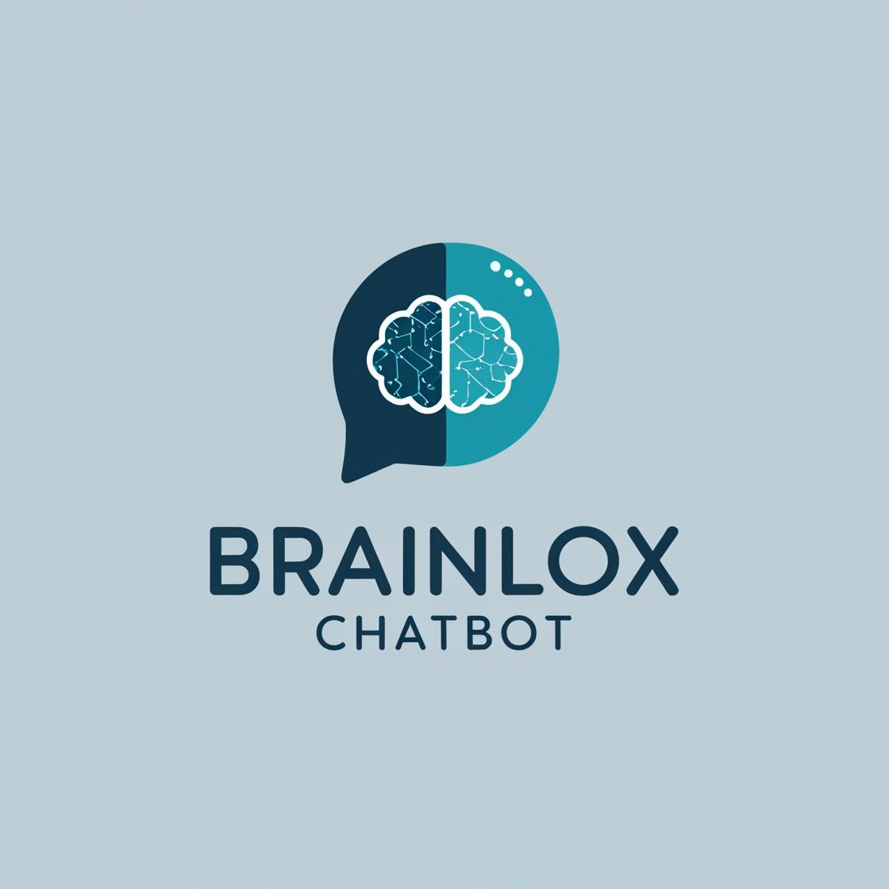

# BrainLox Chatbot
<div align="center">
  
</div>

A custom chatbot built with LangChain, Flask RESTful API, and Google's Gemini model that allows users to query information about BrainLox technical courses.

## 📋 Table of Contents

- [Overview](#overview)
- [Features](#features)
- [Architecture](#architecture)
- [Technologies Used](#technologies-used)
- [Installation](#installation)
- [Usage](#usage)
- [API Endpoints](#api-endpoints)
- [Environment Variables](#environment-variables)
- [Screenshots](#screenshots)
- [Future Improvements](#future-improvements)
- [License](#license)

## 🔍 Overview

This project implements a web-based chatbot that extracts data from BrainLox's technical courses webpage, processes it using LangChain's document handling and vector storage capabilities, and provides a conversational interface for users to ask questions about the available courses. The application uses Google's Gemini model for generating responses.

## ✨ Features

- **Web Scraping**: Extracts course information from BrainLox's technical courses webpage
- **Text Processing**: Splits documents into chunks for efficient processing
- **Vector Storage**: Creates embeddings and stores them in a FAISS vector database
- **Conversational AI**: Uses Google's Gemini model to generate relevant responses
- **RESTful API**: Provides API endpoints for loading data, asking questions, and resetting chat history
- **Web Interface**: Simple UI for interacting with the chatbot

## 🏗️ Architecture

The application follows a classic web application architecture with a backend Flask server that handles both API requests and serves HTML content:

1. **Data Loading Layer**: Uses WebBaseLoader to extract data from BrainLox website
2. **Processing Layer**: Splits documents and creates embeddings
3. **Storage Layer**: Stores embeddings in a FAISS vector store
4. **Conversation Layer**: Handles retrieving relevant context and generating responses
5. **API Layer**: RESTful endpoints for client interaction
6. **UI Layer**: Simple HTML interface for user interaction

## 🛠️ Technologies Used

- **Flask**: Web framework for the backend
- **Flask-RESTful**: Extension for building RESTful APIs
- **LangChain**: Framework for building applications with LLMs
- **Google Gemini**: LLM for generating conversational responses
- **FAISS**: Vector database for storing and retrieving embeddings
- **Python-dotenv**: For managing environment variables
- **HTML/CSS**: For the user interface

## 📥 Installation

1. Clone the repository:
```bash
git clone https://github.com/yourusername/brainlox-chatbot.git
cd brainlox-chatbot
```

2. Create a virtual environment and activate it:
```bash
python -m venv venv
source venv/bin/activate  # On Windows: venv\Scripts\activate
```

3. Install the required packages:
```bash
pip install flask flask-restful langchain langchain-community langchain-google-genai faiss-cpu python-dotenv google-generativeai
```

4. Create a `.env` file in the project root with your Google API key:
```
GOOGLE_API_KEY=your_api_key_here
```

## 🚀 Usage

1. Start the application:
```bash
python app.py
```

2. Open a web browser and navigate to:
```
http://127.0.0.1:5000/
```

3. Use the interface to:
   - Load data from the BrainLox website
   - Ask questions about technical courses
   - View the conversation history
   - Reset the chat when needed

## 🔌 API Endpoints

The application provides the following RESTful API endpoints:

- **GET /api/load**: Loads data from the BrainLox website and initializes the chatbot
- **POST /api/ask**: Accepts a question and returns an answer based on the loaded data
  - Request body: `{"question": "your question here"}`
  - Response: `{"answer": "answer text here"}`
- **POST /api/reset**: Resets the chat history

## 🔑 Environment Variables

The application requires the following environment variable:

- `GOOGLE_API_KEY`: ''

## 📷 Screenshots

- User interface of chatbot
  

## 🔮 Future Improvements

- Implement authentication for API access
- Add support for additional data sources
- Improve the embedding model for better semantic understanding
- Enhance the UI with real-time updates using JavaScript
- Add logging and monitoring capabilities
- Implement caching for improved performance

## 📄 License

This project is licensed under the MIT License - see the LICENSE file for details.

---

Created by [rohan kardam](#https://www.linkedin.com/in/rohan-kardam-3974aa301/) 

Created by [Inderjeet Singh](#https://www.linkedin.com/in/inderjeet-singh-26n/)

 Feel free to contact us at [rohankardam0@gmail.com],[inder26112004@gmail.com]
